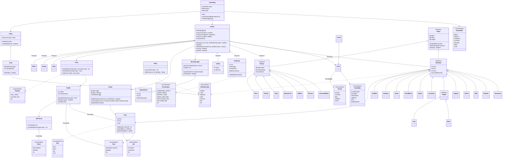

# UML class diagram

Mermaid source. Paste into mermaid.live or the GitHub preview to render, then export a PNG for submission.

```mermaid
classDiagram
    class GameApp {
        -GameState state
        -Board board
        -Shop shop
        +run()
        +mouseClicked(MouseEvent e)
        +main(String[] args)
    }
    class GameState {
        <<enumeration>>
        MENU
        SELECT
        LOADOUT
        PLAYING
        PAUSED
        WON
        LOST
    }
    class Board {
        -Defender[][] grid
        -ArrayList~Enemy~ enemies
        -ArrayList~Projectile~ projectiles
        -ArrayList~Coffee~ coffees
        -int focusPoints
        +place(int row, int col, DefenderType type) boolean
        +update()
        +firstEnemyInLane(int row, double fromX) Enemy
        +isLost() boolean
        +isWon() boolean
    }
    class Level
    class Levels
    Levels --> Level
    Board --> Level
    class Entity {
        <<abstract>>
        #double x
        #double y
        #int health
        +update(Board board)*
        +takeDamage(int amount)
        +isDead() boolean
    }
    class Defender {
        <<abstract>>
        #int row
        #int col
        #int cost
        #int cooldownTicks
    }
    class Generator
    class Shooter
    class Wall
    class Bomb
    class Support
    class Trigger {
        <<abstract>>
    }
    class Mine
    class Trap
    class LaneClear
    class Sniper
    class PointBlank
    class Storm
    class Stomper
    class IronWall
    class ImmuneWalker
    class Reviser
    class Avatar {
        -double height
        -boolean climbing
        +LADDERS int[][]
        +ladderWorks(Level level, int lowerRow) boolean
        +command(int move, int vertical, boolean attack, boolean jump)
        +update(Board board)
    }
    class Hero {
        -int level
        -int exp
        -int ap
        +addExp(int amount) int
        +spend(Stat s) boolean
        +powerMultiplier() double
    }
    class Stat {
        <<enumeration>>
        STR
        DEX
        INT
        LUK
    }
    class Gear {
        <<enumeration>>
        WOODEN_RULER
        BEANIE
        etc
    }
    class Party {
        +award(EnemyType type, int enemyLevel) List
        +rollDrop(EnemyType type) Gear
        +collect(int credits, Gear gear)
    }
    class Profile {
        -int credits
        -int maxUnlocked
        +hero(DefenderType type) Hero
        +buy(Gear gear) boolean
        +save(File file)
    }
    class Terrain {
        <<enumeration>>
        FLOOR
        LOCKER
        MILK
        CARPET
        HYPE
    }
    class GameMap {
        <<enumeration>>
        CLASSROOM
        HALLWAY
        CAFETERIA
        LIBRARY
        GYM
        ADMISSIONS
    }
    class Drop
    class Popup
    class Job {
        <<enumeration>>
        PITCHER
        CATAPULT
        etc
    }
    class KeyItem {
        <<enumeration>>
        HALL_PASS
        LOCKER_KEY
        etc
    }
    class Quest {
        <<enumeration>>
        BUSYWORK
        PATROL
        etc
    }
    class QuestLog {
        +accept(Quest q)
        +recordKill(EnemyType type) List
    }
    class Story {
        +forLevel(int level) List
        +fill(String text, int attempt) String
    }
    class Effect
    class DefenderType {
        <<enumeration>>
        AARAV
        LUIS
        IMRAAN
        SAM
        AUSTIN
        NIK
        etc
    }
    class Enemy {
        <<abstract>>
        #double speed
        #int biteDamage
        #int slowTicks
    }
    class Walker
    class ReportCard
    class Flyer
    class Drainer
    class Boss
    class EnemyType {
        <<enumeration>>
        HOMEWORK_SHEET
        SHARP_PENCIL
        REPORT_CARD
        PAPER_AIRPLANE
        APPLICATION_FEE
        THE_DEADLINE
        etc
    }
    class Projectile {
        -int row
        -int damage
        -int slowTicks
        -boolean piercing
        +update(Board board)
    }
    class Coffee {
        -int value
        -int lifeTicks
    }
    class Shop {
        -ArrayList~Card~ cards
        +select(int index)
        +canAfford(int sp) boolean
    }
    class Card {
        -DefenderType type
        -int rechargeTicks
        +isReady() boolean
    }
    class WaveManager {
        -ArrayList~SpawnEvent~ events
        -Random rng
        +spawnDue(int tick, Board board)
        +isFinished() boolean
    }
    class SpawnEvent {
        -int tick
        -int row
        -EnemyType type
    }

    GameApp --> GameState
    GameApp --> Board
    GameApp --> Shop
    Board o-- Defender : 5x9 array
    Board o-- Enemy : ArrayList
    Board o-- Projectile : ArrayList
    Board o-- Coffee : ArrayList
    Board --> WaveManager
    Entity <|-- Defender
    Entity <|-- Enemy
    Defender <|-- Generator
    Defender <|-- Shooter
    Defender <|-- Wall
    Defender <|-- Bomb
    Defender <|-- Support
    Defender <|-- Trigger
    Trigger <|-- Mine
    Trigger <|-- Trap
    Defender <|-- LaneClear
    Defender <|-- Sniper
    Defender <|-- PointBlank
    Defender <|-- Storm
    Defender <|-- Stomper
    Defender <|-- IronWall
    Enemy <|-- ImmuneWalker
    Enemy <|-- Reviser
    Board --> Avatar
    Board --> Party
    Board o-- Drop : ArrayList
    Board o-- Popup : ArrayList
    Avatar --> Hero
    Defender --> Hero
    Party --> Profile
    Profile o-- Hero : EnumMap
    Profile o-- Gear : EnumMap
    Hero --> Gear
    Hero --> Job
    Profile --> QuestLog
    QuestLog o-- Quest : EnumMap
    Story ..> DefenderType
    Party ..> KeyItem
    Hero ..> Stat
    Level --> GameMap
    Level --> Terrain : Terrain[5][9]
    Board o-- Effect : ArrayList
    Enemy <|-- Walker
    Enemy <|-- ReportCard
    Enemy <|-- Flyer
    Enemy <|-- Drainer
    Enemy <|-- Boss
    Enemy ..> EnemyType
    Defender ..> DefenderType
    Shop o-- Card
    Card --> DefenderType
    WaveManager o-- SpawnEvent
```
